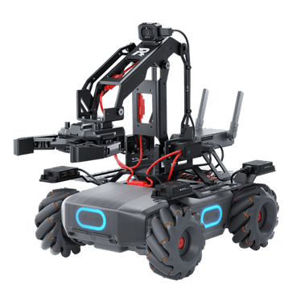
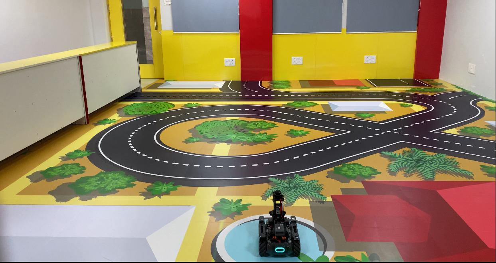
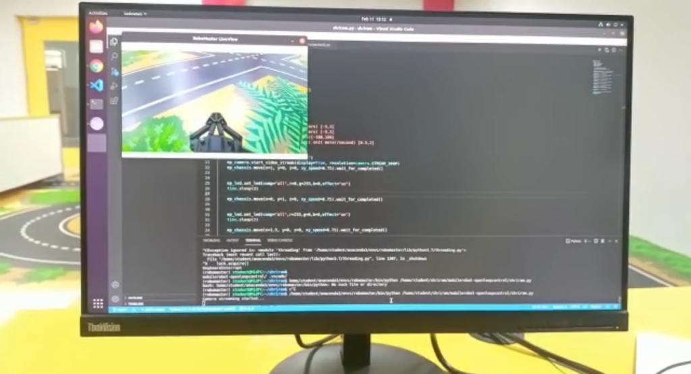
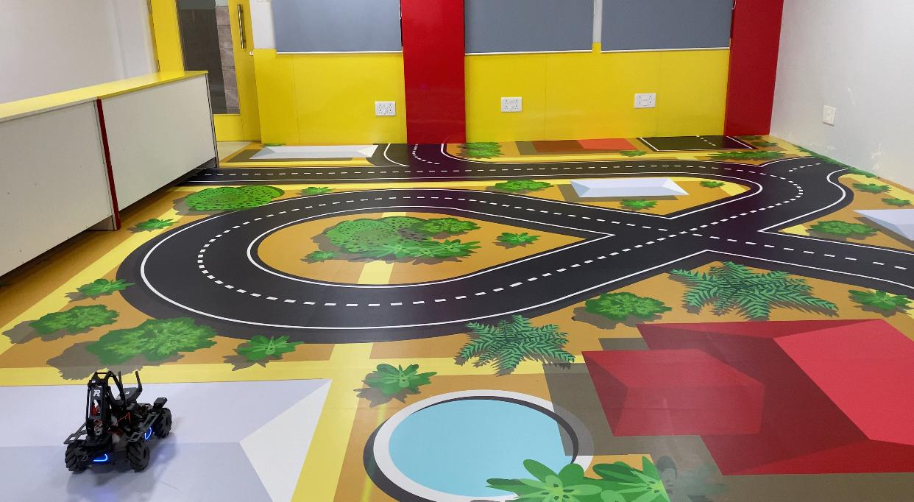

# MobileRobot-Openloopcontrol
## Aim:

To develop a python control code to move the mobilerobot along the predefined path.

## Equipments Required:
1. RoboMaster EP core
2. Python 3.7

## Procedure

### Step1:

Use from robomaster import robot

### Step2:

Choose the x,y,z - axis movement distance(meters).

### Step3:
Give ep_camera = ep_robot.camera. This enables and disables the live streaming.
Give ep_chassis.move to give linear moment to the robot. Add values of your own for each axis of x, y, and z respectively.

### Step4:

Use time.sleep() for a break.

### Step5:

Give ep_led = ep_robot.led for change of led light.

## Program
~~~
To develop a Python program to implement the movement of the mobile robot.
Developed by : Shrruthilaya G
Register number : 212221230097

from robomaster import robot
import time
from robomaster import camera

if __name__ == '__main__':
    ep_robot = robot.Robot()
    ep_robot.initialize(conn_type="ap")
    
    ep_chassis = ep_robot.chassis
    ep_camera = ep_robot.camera
    ep_led = ep_robot.led
    
    '''
    x = x-axis movement distance,( meters) [-5,5]
    y = y-axis movement distance,( meters) [-5,5]
    z = rotation about z axis ( degree)[-180,180]
    xy_speed = xy axis movement speed,( unit meter/second) [0.5,2]
    '''
    print("Camera streaming started...")
    ep_camera.start_video_stream(display=True, resolution=camera.STREAM_360P) 

    ep_chassis.move(x=1, y=0, z=0, xy_speed=0.75).wait_for_completed()
    
    ep_led.set_led(comp="all",r=0,g=255,b=0,effect="on")
    time.sleep(2)
    
    ep_chassis.move(x=0, y=1, z=0, xy_speed=0.75).wait_for_completed()
    
    ep_led.set_led(comp="all",r=255,g=0,b=0,effect="on")
    time.sleep(2)
    
    ep_chassis.move(x=1.5, y=0, z=0, xy_speed=0.75).wait_for_completed()
    
    ep_led.set_led(comp="all",r=0,g=0,b=255,effect="on")
    time.sleep(2)
    
    ep_chassis.move(x=0, y=0, z=90, xy_speed=0.75).wait_for_completed()
    
    ep_led.set_led(comp="all",r=255,g=0,b=0,effect="on")
    time.sleep(2)
    
    ep_chassis.move(x=2, y=0, z=0, xy_speed=0.75).wait_for_completed()
    
    ep_led.set_led(comp="all",r=0,g=255,b=0,effect="on")
    time.sleep(2)
    
    ep_chassis.move(x=0, y=0, z=90, xy_speed=0.75).wait_for_completed()
    
    ep_led.set_led(comp="all",r=0,g=0,b=255,effect="on")
    time.sleep(2)
    
    ep_chassis.move(x=2.5, y=0, z=0, xy_speed=0.75).wait_for_completed()
    
    ep_camera.stop_video_stream()
    
    print("Stopped video streaming...")
    ep_robot.close()
~~~
## MobileRobot Image:


## MobileRobot Movement Video:
Video link : https://youtu.be/ROj2a1_ZUPw

## MobileRobot Movement Snaps:
### Initial point:


### Live stream:


### End point:

## Result:
Thus the python program code is developed to move the mobilerobot in the predefined path.

```
Mobile Robotics Laboratory
Department of Artificial Intelligence and Data Science/ Machine Learning
Saveetha Engineering College
```
